<p align="center">
  
</p>

```bash
retr0@white-server:~$ cat /etc/motd
```

```text
================================================================================
██████╗ ███████╗████████╗██████╗  ██████╗ ███╗   ██╗ ██████╗ ██████╗ ███████╗
██╔══██╗██╔════╝╚══██╔══╝██╔══██╗██╔═══██╗████╗  ██║██╔═══██╗██╔══██╗██╔════╝
██████╔╝█████╗     ██║   ██████╔╝██║   ██║██╔██╗ ██║██║   ██║██║  ██║█████╗  
██╔══██╗██╔══╝     ██║   ██╔══██╗██║   ██║██║╚██╗██║██║   ██║██║  ██║██╔══╝  
██║  ██║███████╗   ██║   ██║  ██║╚██████╔╝██║ ╚████║╚██████╔╝██████╔╝███████╗
╚═╝  ╚═╝╚══════╝   ╚═╝   ╚═╝  ╚═╝ ╚═════╝ ╚═╝  ╚═══╝ ╚═════╝ ╚═════╝ ╚══════╝
================================================================================
 * System:      Linux white-server 6.1.0-rt-amd64
 * Status:      Fully automated & secure
 * Kernel:      x86_64 GNU/Linux
 * Terminal:    ttyS001 (monochrome CRT green #00FF99)
 * Alert:       No vulnerabilities found. Annoying, but responsible.
================================================================================
```

```bash
retr0@white-server:~$ uptime
```

```text
<!-- START_UPTIME -->
 19:00:19 up 47 days, 07:00,  1 user,  load average: 0.07, 0.15, 0.34
<!-- END_UPTIME -->
```

```bash
retr0@white-server:~$ whoami --profile
```

```yaml
---
user: "retr0"
hostname: "white-server"
roles:
  - "Cybersecurity Researcher / Red Teamer"
  - "Automation Engineer"
  - "Linux System Enthusiast"
status: "Monitoring network traffic and securing endpoints"
location: "127.0.0.1"
mission: "Automating tasks, hardening systems, and debugging reality."
certifications:
  - "OSCP (Offensive Security Certified Professional)"
  - "CEH (Certified Ethical Hacker)"
  - "eWPT (eLearnSecurity Web Application Penetration Tester)"
---
```

```bash
retr0@white-server:~$ tree --dirsfirst /home/retr0/skills
```

```text
/home/retr0/skills
├── offensive
│   ├── scanning_recon
│   │   ├── nmap
│   │   ├── gobuster
│   │   └── ffuf / shodan
│   ├── vuln_analysis
│   │   ├── burp_suite_pro
│   │   └── owasp_zap / nikto
│   └── exploitation
│       ├── metasploit / sqlmap
│       ├── john_the_ripper / hydra
│       └── web_vulns (xss, sqli, ssrf, lfi, oauth_bypass)
├── defensive
│   ├── traffic_analysis
│   │   ├── wireshark
│   │   └── tcpdump
│   ├── threat_detection
│   │   ├── suricata
│   │   └── snort
│   ├── security_monitoring
│   │   └── elk_stack / splunk
│   └── hardening
│       └── docker_bench / trivy / kubernetes
├── automate_and_develop
│   ├── programming_languages
│   │   ├── python / go
│   │   └── bash / powershell
│   ├── infrastructure
│   │   ├── linux_unix_admin
│   │   └── docker / git
│   └── custom_tooling
│       └── port_scanners / fuzzers
└── ctf_and_research
    ├── focus_areas (web, reverse, pwn, crypto, forensic)
    ├── learning_platforms (hackthebox, tryhackme, portswigger)
    └── security_research (0-day_tracking)
```

```bash
retr0@white-server:~$ cat /var/log/active_ops.json
```

```json
<!-- START_OPS -->
{
  "PID_8043": {
    "process": "subdomain-scanner-go",
    "status": "optimizing_concurrency",
    "progress": "85%"
  },
  "PID_2210": {
    "process": "preparation-osep-cert",
    "status": "active_study",
    "progress": "50%"
  },
  "PID_1337": {
    "process": "ctf-competition-engagement",
    "status": "solving_reverse_pwn",
    "progress": "running"
  }
}
<!-- END_OPS -->
```

```bash
retr0@white-server:~$ systemctl status motivation.service
```

```text
● motivation.service - Motivation Daemon
     Loaded: loaded (/etc/systemd/system/motivation.service; enabled; vendor preset: enabled)
     Active: failed (Result: core-dump) since Wed 2026-07-01 18:00:21 MSK; 3h 54min ago
   Main PID: 1337 (code=dumped, signal=ABRT)
     Status: "Failed to establish meaningful dopamine loop."
```

```bash
retr0@white-server:~$ ping -c 1 reality
```

```text
PING reality (127.0.0.1) 56(84) bytes of data.

--- reality ping statistics ---
1 packets transmitted, 0 received, 100% packet loss, time 0ms
Request timed out.
```

```bash
retr0@white-server:~$ query-analytics --github
```

<p align="left">
  <a href="https://github.com/anuraghazra/github-readme-stats">
    
  </a>
  <a href="https://github.com/anuraghazra/github-readme-stats">
    
  </a>
</p>

<br clear="both" />

<details>
  <summary>🔑 retr0@white-server:~$ gpg --decrypt contacts.asc.gpg</summary>
  <br />
  <pre>
gpg: encrypted with 4096-bit RSA key, ID FAD1337BEEF, created 2026-07-01
      "retr0 &lt;retr0@example.com&gt;"
gpg: Signature made Wed Jul  1 18:00:00 2026 MSK
gpg:                using RSA key FAD1337BEEF
gpg: Good signature from "retr0 &lt;retr0@example.com&gt;"

=============================================
--- DECRYPTED CONTACT INFO ---
=============================================
Telegram:   https://t.me/retr0_sec
Keybase:    https://keybase.io/retr0_sec
E-mail:     retr0@example.com
=============================================

-----BEGIN PGP PUBLIC KEY BLOCK-----
Version: OpenPGP.js v4.10.2

mQINBF2Wv...
[INSERT YOUR PUBLIC PGP KEY HERE]
-----END PGP PUBLIC KEY BLOCK-----
  </pre>
</details>

<br />

```bash
retr0@white-server:~$ fortune | cowsay
```

```text
 _________________________________________
/ Security is not a product, but a        \
\ process. - Bruce Schneier               /
 -----------------------------------------
        \   ^__^
         \  (oo)\_______
            (__)\       )\/\
                ||----w |
                ||     ||
```
